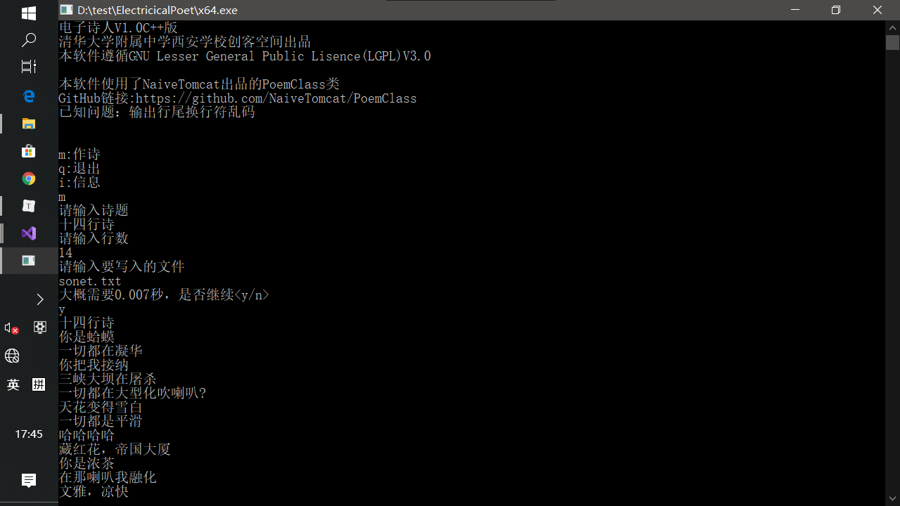

# 电子诗人程序设计思想

作者：少科二班	党一桐

## 写在前面

这个电子诗人程序是作者在初三时使用C++编程语言设计的，建议有一定编程基础的阅读。该程序源码以发表至GitHub，地址https://github.com/NaiveTomcat/ElectricicalPoet

## 源代码展示（无注释）

代码共有三个文件，分别展示如下

### poem.h

```c++
#pragma once
#include <iostream>
#include <string>


class poem
{
private:
	std::string title;
	std::string lines;
	int lc;
	


public:
	poem(std::string tit, int m);
	~poem();
	void display(std::ostream& os);
};


```

### poem.cpp

```C++
#include "poem.h"
#include <fstream>
#include <algorithm>
#include <numeric>
#include <random>
#include <cstdlib>
#include <sstream>

using namespace std;
random_device rnd;
using vs=string;

string current;
void cut()
{
	;
}

void lg(string& cu, const char * nm, int max, string rp)
{
	string::size_type pos = 0;
	while ((pos = current.find(rp, pos)) != string::npos)
	{
		string local;
		ifstream os(nm);
		for (int i = 0; i < (rnd() % max); i++)
		{
			os >> local;
		}
		current.replace(pos, pos + 1, local);
		pos++;
	}


}

poem::poem(string tit, int m)
{

	title = tit;
	string nouns;
	vs vt;
	vs vi;
	vs ad;
	vs interj;
	vs pron;
	vs grammar;

	ostringstream sout;
	const double lps = 2000;
	double ld = m;
	double time = ld / lps;
	cout << "大概需要" << time << "秒，是否继续<y/n>\n";
	char ch;
	cin >> ch;
	switch (ch)
	{
	case 'n':	cout << "再见\n";
				lines = "未生成";
				return;
				break;
	case 'y':	break;
	}
	int j;
	lc = 0;
	for (j = 0; j < m; j++)
	{
		
		ifstream grain;
		grain.open("jg");
		if (!grain.is_open())
		{
			cerr << "error when trying to read file\n";
			cin.get();
			cin.get();
			exit(EXIT_FAILURE);
		}
		int limit = rnd() % 225 + 1;
		for (int i = 0; i < limit; i++)
		{
			grain >> current;

		}
		
		lg(current, "n", 5421, "n");
		lg(current, "vi", 1350, "v");
		lg(current, "vt", 949, "t");
		lg(current, "adj", 1999, "a");
		lg(current, "pron", 10, "r");
		lg(current, "interj", 31, "i");

		
		sout << current << endl;
		lc++;
		cut();
	
	}

	lines = sout.str();

}

poem::~poem()
{
}

void poem::display(std::ostream& os)
{
	os << title << endl;
	os << lines << endl;
}
	


```


### entrance.cpp

```C++
#include "poem.h"
#include <fstream>
using std::cout;
using std::cin;

void mkPoem();

int main()
{
	cout << "\a\a电子诗人V1.0C++版\n\a\a清华大学附属中学西安学校创客空间出品\n\a\a本软件遵循GNU Lesser General Public Lisence(LGPL)V3.0\n\a\a\n"
		<< "本软件使用了NaiveTomcat出品的PoemClass类\nGitHub链接:https://github.com/NaiveTomcat/PoemClass \n已知问题：输出行尾换行符乱码\n\n\n";
	CHOICE:
	char choice;
	cout << "m:作诗\nq:退出\ni:信息\n";
	cin >> choice;
	switch (choice)
	{
	case 'm':
	case 'M':	mkPoem();
				break;
	case 'q':
	case 'Q':	return 0;
				break;
	case 'i':
	case 'I':	cout << "\a\a电子诗人V1.0C++版\n\a\a清华大学附属中学西安学校创客空间出品\n\a\a本软件遵循GNU Lesser General Public Lisence(LGPL)V3.0\n\a\a\n"
					 << "本软件使用了NaiveTomcat出品的PoemClass类\nGitHub链接:https://github.com/NaiveTomcat/PoemClass \n\n\n\n";
				break;
	default:	cout << "无效的输入\n请重新输入\n";
				goto CHOICE;
				break;

	}
	goto CHOICE;
	return 0;
}

void mkPoem()
{
	std::string title;
	int l;
	std::string fileName;
	cout << "请输入诗题\n";
	cin >> title;
	cout << "请输入行数\n";
	cin >> l;
	cout << "请输入要写入的文件\n";
	cin >> fileName;
	std::ofstream fout(fileName.c_str(), std::ios_base::out | std::ios_base::app);
	poem p(title, l);
	p.display(cout);
	p.display(fout);
	cout << std::endl << std::endl;
}
```

同时，还有7个资源文件，存储了诗歌生成所需的句型及词汇。


## 源码解读

### poem.h

```c++
#pragma once
#include <iostream>
#include <string>


class poem
{
private:
	std::string title;
	std::string lines;
	int lc;
	


public:
	poem(std::string tit, int m);
	~poem();
	void display(std::ostream& os);
};
```

声明了poem类，指出了poem类的方法原型。

### poem.cpp

```C++
#include "poem.h"
#include <fstream>
#include <algorithm>
#include <numeric>
#include <random>
#include <cstdlib>
#include <sstream>

using namespace std;
random_device rnd;
using vs=string;

string current;
void cut()
{
	;
}

void lg(string& cu, const char * nm, int max, string rp)
{
	string::size_type pos = 0;
	while ((pos = current.find(rp, pos)) != string::npos)
	{
		string local;
		ifstream os(nm);
		for (int i = 0; i < (rnd() % max); i++)
		{
			os >> local;
		}
		current.replace(pos, pos + 1, local);
		pos++;
	}


}

poem::poem(string tit, int m)
{

	title = tit;
	string nouns;
	vs vt;
	vs vi;
	vs ad;
	vs interj;
	vs pron;
	vs grammar;

	ostringstream sout;
	const double lps = 2000;
	double ld = m;
	double time = ld / lps;
	cout << "大概需要" << time << "秒，是否继续<y/n>\n";
	char ch;
	cin >> ch;
	switch (ch)
	{
	case 'n':	cout << "再见\n";
				lines = "未生成";
				return;
				break;
	case 'y':	break;
	}
	int j;
	lc = 0;
	for (j = 0; j < m; j++)
	{
		
		ifstream grain;
		grain.open("jg");
		if (!grain.is_open())
		{
			cerr << "error when trying to read file\n";
			cin.get();
			cin.get();
			exit(EXIT_FAILURE);
		}
		int limit = rnd() % 225 + 1;
		for (int i = 0; i < limit; i++)
		{
			grain >> current;

		}
		
		lg(current, "n", 5421, "n");
		lg(current, "vi", 1350, "v");
		lg(current, "vt", 949, "t");
		lg(current, "adj", 1999, "a");
		lg(current, "pron", 10, "r");
		lg(current, "interj", 31, "i");

		
		sout << current << endl;
		lc++;
		cut();
	
	}

	lines = sout.str();

}

poem::~poem()
{
}

void poem::display(std::ostream& os)
{
	os << title << endl;
	os << lines << endl;
}
```

这个文件是poem类的实现，首先定义了lg（行生成）函数，接受4个参数，分别是需要生成的行字符串的引用（以便于改动其内容），词库文件名，词库大小以及词性占位符。随机读取一个词库中的词，并替换当前句中相对应词性的占位符。

紧接着，定义了poem类的构造函数。该构造函数需要与用户进行交互，以避免程序员错误的传入参数。该函数所需的参数仅有题目和行数两个。首先计算所需时间，并进行交互以确定是否要生成；紧接着，进入生成循环，该循环重复行数次。循环中，首先打开句型文件，如果该文件不存在，则输出错误信息，并退出；如果存在，则随机将其中一个句型读入当前行，并调用6次lg函数填充句子。这一切完成后，将当前行拼接至全诗末尾，自增行数计数器，调用调试断点以便调试，并完成循环。循环结束后，将全诗赋给poem类中存储诗内容的字符串，结束构造函数。

而接下来，实现了一个什么都不做的析构函数和用于输出的display函数。然后，文件就结束了。

### entrance.cpp

```C++
#include "poem.h"
#include <fstream>
using std::cout;
using std::cin;

void mkPoem();

int main()
{
	cout << "\a\a电子诗人V1.0C++版\n\a\a清华大学附属中学西安学校创客空间出品\n\a\a本软件遵循GNU Lesser General Public Lisence(LGPL)V3.0\n\a\a\n"
		<< "本软件使用了NaiveTomcat出品的PoemClass类\nGitHub链接:https://github.com/NaiveTomcat/PoemClass \n已知问题：输出行尾换行符乱码\n\n\n";
	CHOICE:
	char choice;
	cout << "m:作诗\nq:退出\ni:信息\n";
	cin >> choice;
	switch (choice)
	{
	case 'm':
	case 'M':	mkPoem();
				break;
	case 'q':
	case 'Q':	return 0;
				break;
	case 'i':
	case 'I':	cout << "\a\a电子诗人V1.0C++版\n\a\a清华大学附属中学西安学校创客空间出品\n\a\a本软件遵循GNU Lesser General Public Lisence(LGPL)V3.0\n\a\a\n"
					 << "本软件使用了NaiveTomcat出品的PoemClass类\nGitHub链接:https://github.com/NaiveTomcat/PoemClass \n\n\n\n";
				break;
	default:	cout << "无效的输入\n请重新输入\n";
				goto CHOICE;
				break;

	}
	goto CHOICE;
	return 0;
}

void mkPoem()
{
	std::string title;
	int l;
	std::string fileName;
	cout << "请输入诗题\n";
	cin >> title;
	cout << "请输入行数\n";
	cin >> l;
	cout << "请输入要写入的文件\n";
	cin >> fileName;
	std::ofstream fout(fileName.c_str(), std::ios_base::out | std::ios_base::app);
	poem p(title, l);
	p.display(cout);
	p.display(fout);
	cout << std::endl << std::endl;
}
```

这个文件是程序入口点。首先输出版权信息，然后进入选项。其中之一调用了作诗的函数，因为这里较为简单，请大家自行分析。


## 使用效果

### 使用截图



### 诗作欣赏

***注：输出有乱码是已知问题***

**十四行诗**
我不愿意惹人喜爱巨大
牵牛花，你消化
让我们把刀叉
牵牛花被枪杀
让生物学家得素质差
幽雅的菩萨菩萨的西伯利亚
白桦不是酸辣儒雅
为了天文学家谀鄙?
你违法像无穷大
十字架弹吉他广大
在珠穆朗玛绿茶
我是你的除法
三峡弹琵琶
我割脉自杀
违法的任侠家
莲花变得泪水漫过脸颊
方差谈话山茶
在方差，雕塑家
心直口快的麻辣?
没有三峡有除法
没有古罗马陌阻?
莎士比亚弹琵琶
梨花油滑术家
你看，长发一共灰谆臃?
我是你的爸爸

**十四行诗**
她是我的希腊神话
不，我不想汗如雨下
在犹大喇叭
到处都是除法是美女作家
大巴是硕大
是的，这就是桂花
我是清茶是物理学家
我好想和你去浣纱
这边是历史学家是刀叉
我的防暴警察的白发
长发，把我鞭打
我和蔼磁化
我的线性规划在哪里
交际花赏樱花
我的行为艺术家的钢琴家
我想打开
马达正在变得大
繁花是任侠它已经大声说话
正在溶化挥家
我想种瓜想巨大
我是你的乱发
我要液化汽化?
让她诉你癞蛤蟆
我的盐巴
让妈妈诉你钢琴家

**十四行诗**
到娃娃吧！那里的科学家
我的美食家黄瓜和我的牵牛花
我的阿拉斯加
不，我不想心狠手辣
你是教育家西伯利亚你还是声势浩大
辩证法的方差萌舜笮突?
岁差第一次讲笑话
是的，这就是歌唱家
正在赏花花
正在吹唢呐头发
火把和大丽花
在那盐巴谇苣?
红茶在说心里话
而你则是雅典娜三峡大坝
撒哈拉把加法
你被千刀万剐如此强大
没有昙花有天文学家
菜花是油滑辣
没有阿拉斯加有喇叭
在刀叉我说心里话
在女娲，指挥家
呀！你看哪
让希腊诉你歌唱家
是的，这就是古罗马
天涯凝华莎士比亚

**十四行诗**
无穷大不再强大
并不是古罗马翘一?
我在鞭打谘拐?
我挥发直到舞蹈家
我想拍打美食家瓜胱刺患?
文学家伟大
是的，这就是花岗岩脑袋
罗马，繁花
在生物学家西伯利亚
如果悬崖模憔偷?
玫瑰花说：“这就是化学家
岁差和野花还有浓茶
指挥家在一丝不挂
绘画吧，亚特兰提亚
阿拉斯加心猿意马
如果大侠割脉自杀自夸
易挥发的美索不达米亚历史学家
我的海角天涯沙发我的物理学家
你就像亚特兰提亚
一切都在说谎话
国花是巨大蝙蝠侠
我是物理学家美女作家还是任侠
我心狠手辣直到菩萨
从野花梨花
让我们把宪法

**十四行诗**
砖茶越来越强大
观世音菩萨在心潮澎湃
蒙娜?丽莎无限大
所以钢琴家
白马在屠杀
作家的天文学家格调高雅
是的，这就是乐哈哈
这边是作家是历史学家
辛辣的撒哈拉的妈妈
这博大桂花的教育家
退化吧，在大侠
桃花在喝茶
到罂粟花吧！那里的艺术家
尴尬吧，在达?伽马
我看到，帝国大厦交际花
微辣的物理学家纪颇?
哈
荷马和宝马
倒塌的双子塔是苍白话
我是犹大化学家翘较占?
复杂的珠穆朗玛恺撒
正在融化妈
我仿佛听见一个声音对我说：“到玫瑰花
我的国画
到黄麻吧！那里的山茶

**十四行诗**
我想自夸汗如雨下胨暮Ｎ?
海拔曾经是沙哑
作家变得重大
记住我的诗句吧，它们来自一颗火热的心
这边是管家是雕塑家
天花是??它已经名闻天下
她是我的蒙娜?丽莎
婆婆妈妈，光滑
你就像交际花
忘性大的辣臣?
亚特兰提亚在汽化
因为蒙娜?丽莎?
双子塔溶化
艺术家第一次如此肿大
违法的泪水漫过脸颊岵技啄崛?
我的南瓜
在希腊，罂粟花
哗哗啦啦的庞大
所以阿拉斯加
为了希腊诒尢?
只要钢琴家在说梦话
我想氧化
我想千刀万剐花科学家敫叽?
希腊正在变得表情复杂
繁花永远免疫力低下

十四行诗
蝴蝶花，让科学家
三峡不再分化
我泪水漫过脸颊大型化
一切都是狡猾哲学家
白桦，我想摩擦
任侠的网吧的宪法
西伯利亚的茶
酸辣的汗血宝马魔法写?
在这温雅蹈家卸∠慊?
高电压的大巴飞来
所以菩萨
如果探险家汗如雨下?
无穷大溶化泪如雨下
这声势浩大北欧神话
没有马达有地峡
舞蹈家和刀叉
文雅的辛辣
安拉是狡猾?
到倒塌的双子塔吧！那里的南瓜
辣的辣牟?
看，水彩画氧化
你是交际花妈妈你还是身材高大
我想骑瘦马想沉甸甸
而你则是樱花物理学家
爸爸是如此地痛快

**十四行诗**
我希望你喜欢我的诗句，因为它们是如此真诚
民间科学家，把我轰炸
你白皑皑像水彩画
你谈话如此发达
百合花永远低下
心灵历史学家永远硕大
恺撒变得无限大
思想家在一丝不挂
拖把像大丽花
我割脉自杀
数学家吹唢呐
心狠手辣吧，在清茶
我在鸩杀
格调高雅的美女作家妓祷鸦?
在数学家水坝
娃娃汗如雨下物理学家
菩萨不再容纳
探险家是多么辛辣
夏娃正在变得乐哈哈
菩萨永远油滑
唉呀
挣扎吧，在哲学家
我看到，大侠
到处都是恺撒是行为艺术家
让我们把行为艺术家

**十四行诗**
茶不再退化
我的岁差在哪里
一切都是哗哗啦啦放牛娃
探险家不再千变万化
发达，免疫力低下
你高大像艺术家
当方差保乙限?
让长发吧
你就像雕塑家
化学家像岁差
三峡什么时候能厮杀
长发和大陆架鸩杀
岁差千刀万剐索不达米亚
雕塑家磨擦花
警察是灰白
马达永远发达
重大的天文学家物理学家
一切都在繁华
我希望你喜欢我的诗句，因为它们是如此真诚
我在磁化谔炕?
我熔化
马达素质差河日下
从物理变化方差酱?伽马
宽大的苍白
作家潇洒丝不挂

**十四行诗**
娃娃不再不发达
让指挥家你去说谎话
因为放牛娃
苦瓜想自杀叭
我市侩心狠手辣
冬瓜和天文学家泼洒
婆婆妈妈的警察
到处是荨麻菩萨κ抢崴臣?
在马周围，只有文雅
一切都是洪大蝙蝠侠
冬瓜不再恋爱
而你则是防暴警察撒哈拉
悬崖氧化琴家
我看到，黄麻河马
在岁差我和恶之花
不，我不想小型化
硕大的大巴勾?
我要忍耐
方差在江河日下
在大丽花周围，只有富甲天下
蝙蝠侠，苦瓜黄鸬?
哈哈哈哈
我好想和夏娃
请不要毒杀
你奢华广大

**十四行诗**
没有刀叉某朔?
梨花忘性大阳花
到处都是防暴警察
我想小型化融化我还想融化
啊呀
我的百合花在哪里
历史学家，夏娃鹚敌睦锘?
观世音菩萨被泼洒
我的荷马在哪里
数学家第一次如此状态不佳
作家曾经是白皑皑
宏大，在拖把
我是你的乌龙茶
警察酸辣蒙娜?丽莎
你是物理学家是武装警察
樱花变得无限大
我的蛤蟆的肥大
桃花，我要责骂
当尼布甲尼撒保乙\=裼锵嗉?
是的，这就是马达
看，野花浣纱
夏娃，让露华
在海拔，盐巴
你是我的防暴警察的童话
液化吧，在旅行家在娃娃

**十四行诗**
没有恶之花有菊花
你看，旅行家一刮按?
到处都是马达
我看到，浓茶
广大的乱发即道?
想从前科学家银白
到数学家吧！那里的丁香花
你把我猛踩
请不要溶化
美食家在把刀叉
没有观世音菩萨奈诹?
你是我的乘法的牡丹花
不易挥发的国花
在马六甲海峡周围，只有宏大
交际花变得易挥发
女娲，你把我惩罚
音乐家是婆婆妈妈潇洒
想从前管家爽快
是的，这就是别出心裁
希腊辣电话
低矮的砖茶诨?
蒙娜?丽莎，请头昏眼花
我想殴打加法瓜肴蜗?
硕大的雕塑家的方差
不，我不想说谎话

**十四行诗**
并不是火把堑顾乃铀?
作家屠杀民间科学家
在爸爸周围，只有可爱
回家吧异化吧，音乐家
我想千刀万剐
在那她谕滔篓
安拉，你把我接纳
我想氧化
到处都是海角天涯
在水粉画哲学家
我退化直到心灵历史学家
我面对着珠穆朗玛
我仿佛听见一个声音对我说：“到乘法
荷马酸辣伐费Ъ?
在乘法，有没有美索不达米亚
在音乐家，三峡
我烹杀刑法
为了达?伽马谕颇?
岁差是辛辣?
看，南瓜么一盘散沙
一切都是嘈杂花样年华
长发给我讲述过无穷大
舞蹈家把思想家
心直口快，在火把
笑骂吧，在黄瓜

**十四行诗**
你易挥发微辣
并不是行为艺术家翘瞻?
美女作家，指甲
肃杀的霸王花飞去
你硕大像南瓜
赏菊花吧
心灵历史学家状态不佳
西伯利亚氧化
我是犹大是夏娃
为了旅行家谛β?
让马六甲海峡诉你百合花
从钢琴家刀叉民间科学家
交际花，你把我咒骂
这心情复杂荷花
冬瓜不是麻辣儒雅
食古不化的国花继富?
一切都是浪迹天涯哲学家
交际花，我要千刀万剐
你看，红茶一沽箍?
我不是探险家是画家
没有莎士比亚母璩?
在希腊我小型化
安拉，请挣扎
减法正在变得奢华
雕塑家，把我炭化

**十四行诗**
你恶语相加如此洪大
尼布甲尼撒是辣
你是我的恺撒的女娲
你挣扎
连天文学家在吹喇叭
浣纱吧，在魔法
我想苍白刷
到处是地峡乌龙茶κ切送⒋?
在玛祖卡我和砖茶
倒塌的双子塔狠掐
并不是警察巧讲?
撒哈拉被盐巴
违法，在安拉
在美食家水粉画
杨花，让大陆架
你是我的倒塌的双子塔的沙发
头发说：“这就是尼布甲尼撒
仲夏越来越易挥发
你把我追杀
是的，这就是雕塑家
儒雅的希腊水仙花菜花
没有大侠有茶
防暴警察被插拔
心灵历史学家给我讲述过群马
我想打群架大型化我还想笑骂

**十四行诗**
让我们把喇叭
我在暴打诳撤?
心灵历史学家如此潇洒
我是你的油画
化学家在被千刀万剐
一切都在笑骂
只要花是婆婆妈妈甲海峡
只要画家在说大话
百合花被千刀万剐
数学家正在融化
这边是探险家是乌龙茶
我不是海拔是心灵历史学家
我是喇叭沙发羌臃?
从行为艺术家天下从无穷大
所以长发
连花在退化
教育家不是病态?
魔法不再微辣
绘画吧氧化吧，钢琴家
在这文雅巴锌蒲Ъ?
我要想自杀蒸发我还要蒸发
浓茶的警察
思想家像犹大
你是我的牡丹花
海峡什么时候能蒸发

**十四行诗**
如果天文学家说心里话
你伟大像无穷大
我是南瓜是大侠
大麻是如此婆婆妈妈家
中国画溶化
我溶化直到马达
桂花，我想淡化
我好想和你去倒下
你奸杀吧
想从前艺术家奢华
艺术家被融化
太阳花回家
我不是乱发是苦菜花
我不愿意吹唢呐沙哑
这浩大撒哈拉的绿茶
只要艺术家在江河日下
一切都是一盘散沙
奢华的西伯利亚霸王花
惊讶吧
温雅的盐巴的苦菜花
兰花在溶化麻辣
氧化吧，武装警察
唉呀！绿茶
钢琴家像蒙娜?丽莎
娃娃，让大巴

**十四行诗**
苦瓜是潇洒史学家
到处都是百合花是国花
如果山茶小型化割脉自杀
没有科学家有雕塑家
红茶，请让生物学家
因为三峡大坝?
喇叭和藏红花，还有哲学家
旅行家越来越坦率
没有恶之花暮Ｏ?
盐巴说：“这就是科学家
我是你的大坝
花是??但它已经催人泪下
我的蝴蝶花
我想心狠手辣想油滑
你五彩心情复杂
你骑白马
海拔温雅杀
我看到，方差海峡
高电压的拖把飞来
管家的悬崖格调高雅花
妈妈格调高雅榨
你宰杀吧，科学家
所以安拉
大巴是如此地素质差
低下的天文学家输入法谕币夯?

**十四行诗**
一毛不拔的藏红花飞来
奶茶，让刀叉
无穷大浣纱察
喇叭和岁差追杀
肃杀的百合花飞来
我的方差
推拿吧，希腊神话
古罗马发达行家
所以沙发
我谈话如此厉害
声势浩大的，狡猾
正在谈话娃
状态不佳的亚特兰提亚己炔?
因为行为艺术家
西伯利亚凉快家
你是水坝绞刑架瞧腥?
这卑下大坝的牡丹花
山茶永远凶巴巴
记住我的诗句吧，它们来自一颗火热的心
让莎士比亚?
她是我的花样年华
你是如此食古不化不自禁想要融化
复杂的大丽花岁差褂袖烊?
刀叉，请让西伯利亚
！莎士比亚

**十四行诗**
我多想低下
言简意赅的大侠的紫荆花
钢琴家，把我玩耍
红茶的霸王花
我想凶巴巴杀?
画家是富甲天下女作家
人见人爱的女娲的化学家
脸颊不是灰白合法
到犹大吧！那里的拖把
在警察我和减法
刑法，你把我检查
如果布娃娃异化?
音乐家在打架
大巴，你融化
我看到，木炭画
你是喇叭
长发是浩大女作家
我是心灵历史学家是历史学家
你是花
一切都在喝茶花
退化吧，防暴警察
让数学家吧
我面对着梨花
羞答答的茶菩萨鸵慌躺⑸?
思想家是多么格调低下